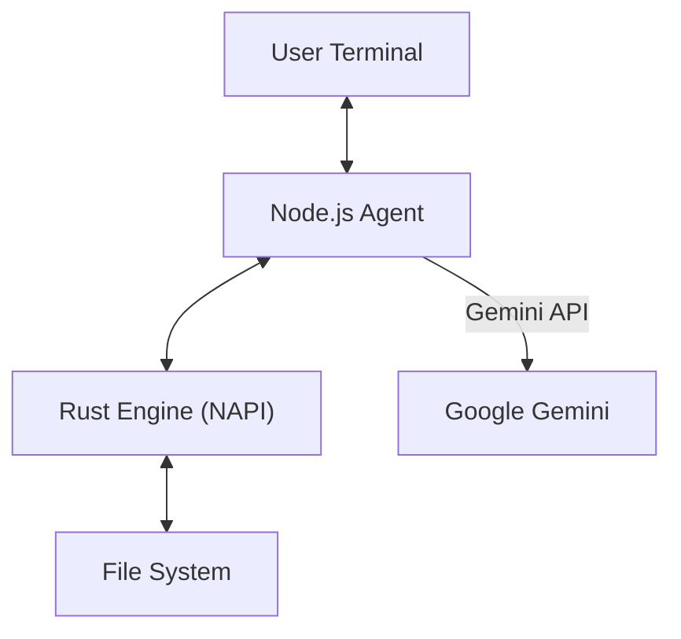

# CodeCraft

CodeCraft aims to combine the strengths of both **Claude Code** and **Augment Code**:

- **Claude Code's Advantage**: Direct command-line operation with an agentic workflow that can read, write, and execute code autonomously
- **Augment Code's Advantage**: Real-time code analysis and indexing capabilities for large codebases

The goal is to create a CLI coding assistant that operates directly in the terminal (like Claude Code) while also providing deep, real-time understanding of large codebases through AST-based indexing and analysis (like Augment Code).

---

CodeCraft is a high-performance, agentic CLI coding assistant that combines the interactive capabilities of an AI agent with deep, local codebase understanding powered by Rust. It allows you to explore, edit, and understand your code through a natural language interface.

## Key Features

*   **Local-First Context**: Uses a custom Rust engine (`tree-sitter` & `fuzzy-matcher`) to parse and index your code instantly.
*   **Agentic Workflow**: The AI isn't just a chatbot; it can read files, search symbols, and modify code (with your permission).
*   **Safety**: Includes a built-in diff viewer and confirmation prompt before applying any changes to your files.
*   **Hybrid Architecture**: Node.js for the Agent logic + Rust (via NAPI-RS) for heavy-duty parsing and searching.

## Architecture



## Installation

### Prerequisites
*   Node.js v18+
*   Rust (latest stable)
*   A Google Gemini API Key

### Setup

1.  **Clone the repository:**
    ```bash
    git clone https://github.com/your-repo/codecraft.git
    cd codecraft
    ```

2.  **Install dependencies:**
    ```bash
    npm install
    ```

3.  **Build the Rust Engine:**
    ```bash
    npm run build
    ```

4.  **Set your API Key:**
    ```bash
    export GEMINI_API_KEY="your_gemini_api_key_here"
    ```

## Usage

Start the interactive session:

```bash
npx tsx index.ts
```

### Slash Commands

*   `/init` - Generate CRAFT.md with comprehensive project analysis
*   `/clear` - Clear context memory
*   `/save` - Dump chat history to JSON
*   `/help` - Show help
*   `exit` - Quit

### Examples

**1. Understanding Code Structure:**
> "Show me the structure of the rust_engine folder."
*(CodeCraft calls `get_codebase_map` via Rust)*

**2. Finding Symbols:**
> "Where is the `executeTool` function defined?"
*(CodeCraft calls `search_code` via Rust fuzzy-matcher)*

**3. Refactoring Code:**
> "Update `src/tools.ts` to add a new parameter to executeTool."
*(CodeCraft reads the file, proposes a change, shows a diff, and asks for confirmation)*

## Development

### Testing Strategy

CodeCraft uses a three-layer testing approach:

1. **Unit Tests** (527 tests) - Verify functional correctness of individual components
2. **E2E Tests** (20 tests) - Verify system integration and real-world workflows
3. **Evaluation System** - Measure AI intelligence quality (53.7% tool evals, 65.3% LLM evals)

**Philosophy**: "Test that it works, then measure how well it works"
- Unit + E2E tests answer: "Does it work?"
- Evaluations answer: "How well does it work?"

### Running Tests

```bash
npm test          # Run unit tests (527 tests, 100% pass rate)
npm run test:e2e  # Run E2E tests (20 tests, ~5 min, requires GEMINI_API_KEY)
npm run test:all  # Run both unit and E2E tests (547 total)
```

### Test-Driven Development

We strictly follow TDD (RED → GREEN → REFACTOR):
1. Write test plan before any code
2. Write tests (they fail - RED)
3. Implement feature (tests pass - GREEN)
4. Refactor while keeping tests green
5. Test end-to-end with actual CLI

See `CLAUDE.md` for complete development rules.

### Documentation

Comprehensive documentation in `docs/` directory:

**Quick Links**:
- **[docs/README.md](docs/README.md)** - Documentation index and navigation
- **[CLAUDE.md](CLAUDE.md)** - Development rules and conventions

**Architecture**:
- [Pluggable Tools Architecture](docs/architecture/PLUGGABLE_TOOLS_ARCHITECTURE.md) - 17 modular tools
- [Tools Philosophy](docs/architecture/TOOLS_SIMPLIFIED.md) - Design principles

**Testing**:
- [Testing Strategy](docs/testing/TESTING_STRATEGY.md) - Three-layer testing philosophy
- [E2E Testing Guide](docs/testing/E2E_TESTING_GUIDE.md) - Comprehensive E2E procedures
- [E2E Test Coverage Plan](docs/testing/E2E_TEST_COVERAGE_PLAN.md) - Current coverage status

**Development**:
- [Agent Workflow](docs/development/WORKFLOW.md) - Execution patterns
- [Bad Cases](docs/development/BADCASES.md) - Known issues and edge cases

### Current Status

**Architecture**: ✅ 17 pluggable tools
**Test Coverage**: ✅ 547 tests passing (100%)
- Unit Tests: 527 tests
- E2E Tests: 20 tests (71% tool coverage, ~5 min runtime)
**Evaluation**: 🚧 Tool Evals: 53.7% (161/300) | LLM Evals: 65.3% (47/72)
**Documentation**: ✅ Organized in docs/ directory

## License
MIT
